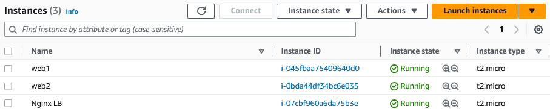
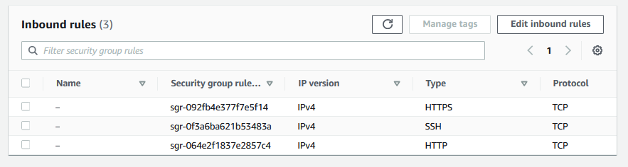
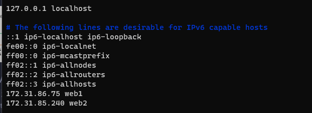
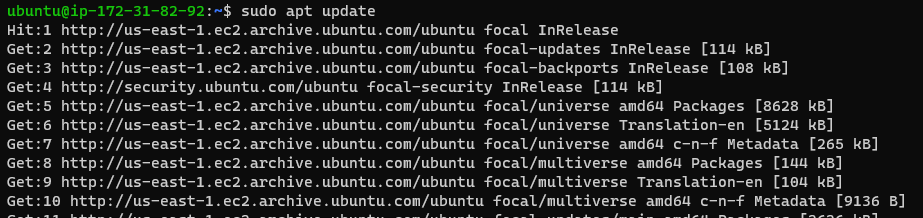
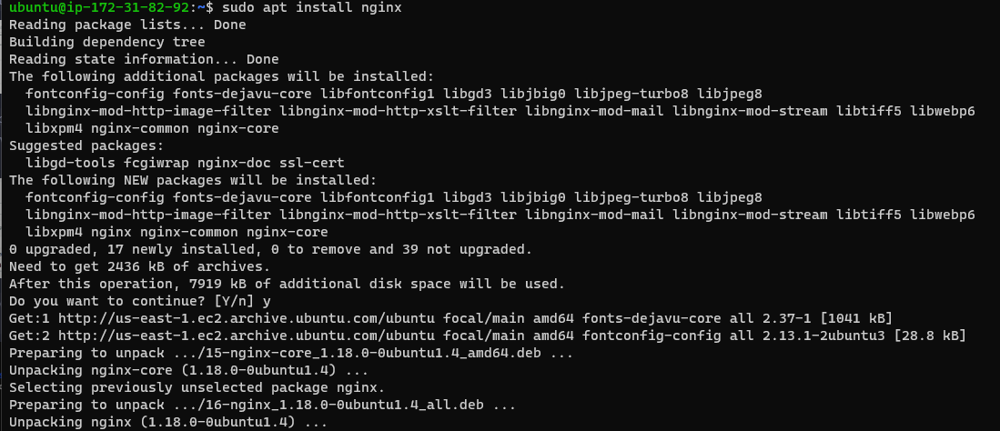
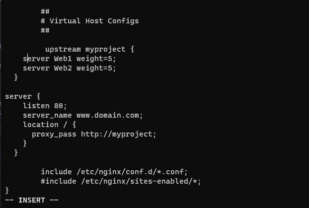
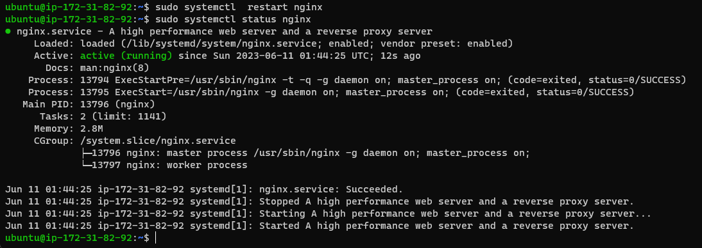

# Labs


##  Configure Apache As A Load Balancer

> Create an Ubuntu Server 20.04 EC2 instance and name it Nginx_LB, so your EC2 list will look like this:



> Open TCP port 80 for http and 443 for https on newly provisioned Nginx_LB server by creating an Inbound Rule in Security Group.



> Update /etc/hosts files for local DNS with Web Servers names



> Install and configure Nginx as a load balancer to point traffic ot the resolvable DNS names of the webservers:

  - Update the instance and install Nginx

        sudo apt update
        sudo apt install nginx

   



> Configure load balancing

  - navigate to the folder

    sudo vi /etc/nginx/nginx.conf

```
#insert following configuration into http section

 upstream myproject {
    server Web1 weight=5;
    server Web2 weight=5;
  }

server {
    listen 80;
    server_name www.domain.com;
    location / {
      proxy_pass http://myproject;
    }
  }

#comment out this line
#include /etc/nginx/sites-enabled/*;
```



---
    sudo systemctl restart nginx
    sudo systemctl status nginx




> Verify that our configuration works – try to access your LB’s public IP address or Public DNS name from your browser:

    http://<Load-Balancer-Public-IP-Address-or-Public-DNS-Name>/index.php

